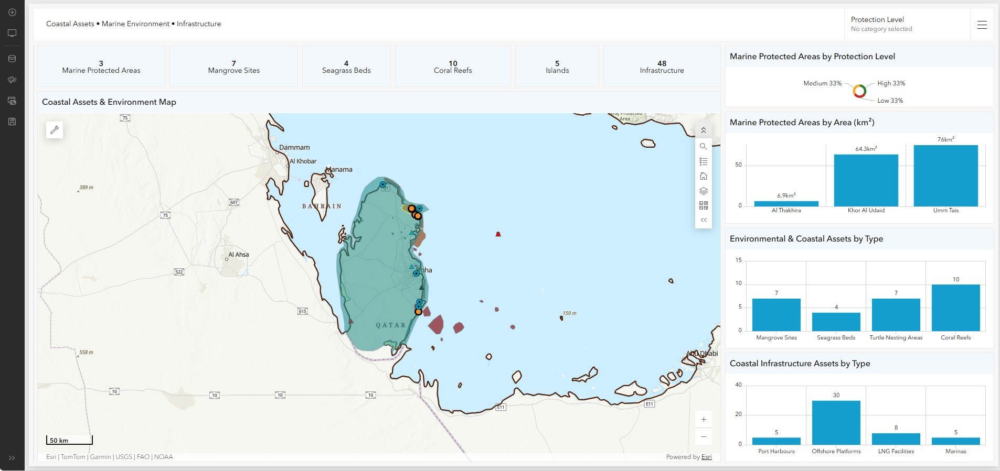
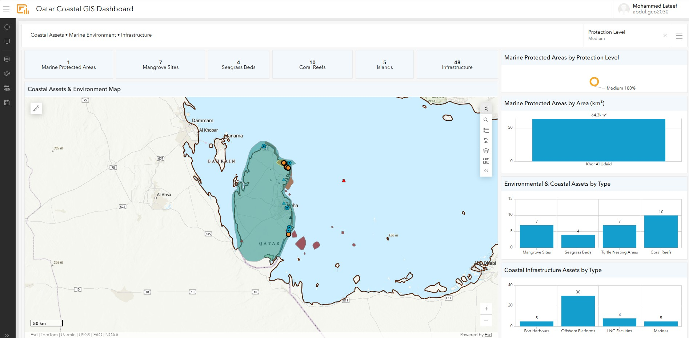
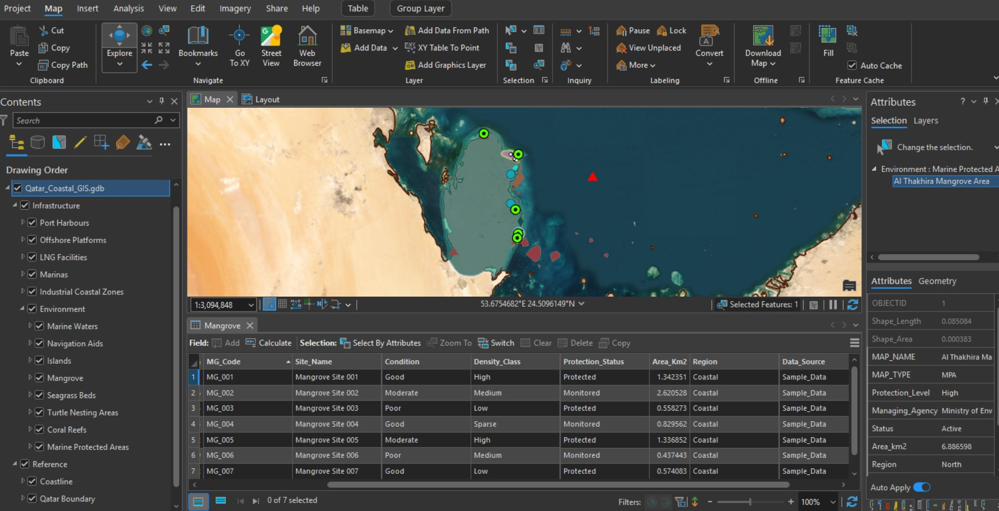
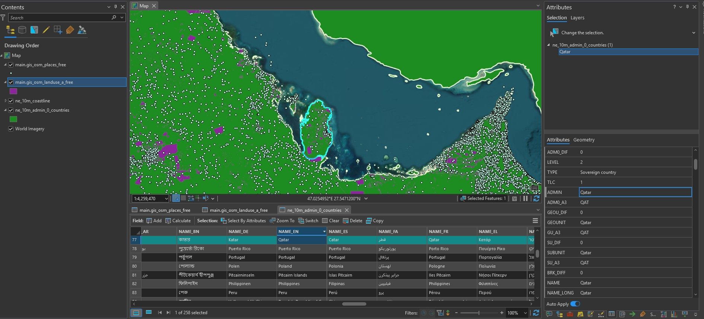

## 🖼️ Project Screenshots

### Qatar Coastal GIS Dashboard

### Dashboard Visualization

### ArcGIS Pro Coastal Data Development

### Qatar Boundary & GIS Workflow

---

## 📄 Project Case Study

A detailed project case study covering the GIS workflow, coastal datasets, Web GIS development, and dashboard implementation is available below:

[📘 View Qatar Coastal GIS Dashboard Case Study](documentation/Qatar_Coastal_GIS_Dashboard_LinkedIn_Case_Study.pdf)
